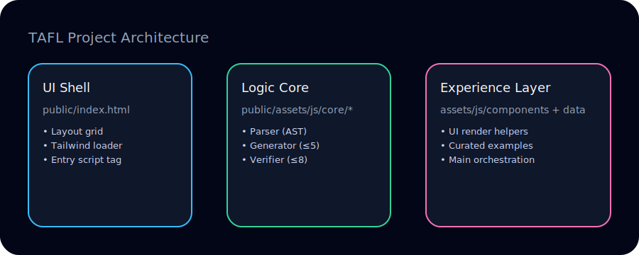

# Interactive Regex Equivalence & String Generator

**Live Demo:** https://mohit-lakra.github.io/TAFL-Project/

A research-inspired Automata Theory studio for comparing two regular expressions, inspecting the strings they accept, and presenting counter-examples with academic polish.

## 📁 Repository Layout
```
TAFL-Project
├── README.md
├── .github/
│   └── workflows/
│       └── pages.yml
└── public/
    ├── index.html
    └── assets/
        ├── css/
        │   └── custom.css
        ├── images/
        │   ├── architecture.svg
        │   └── ui-glimpse.svg
        └── js/
            ├── main.js
            ├── components/
            │   └── ui.js
            ├── core/
            │   ├── generator.js
            │   ├── parser.js
            │   └── verification.js
            └── data/
                └── examples.js
```

## 🎨 Visual Overview



## ✨ Experience Highlights
- **Scholarly Interface** – a dark, minimalist dashboard with thoughtful typography, curated spacing, and status cards that feel lab-ready.
- **Dual Perspectives** – review the strings each expression accepts while a dedicated status panel summarizes the verdict and counter-example.
- **Animated Verification Ticker** – watch a pulse indicator stream through the bounded test suite so students can feel the checking process instead of it being a black box.
- **Curated Gallery** – six handpicked regex pairs (half equivalent, half not) for quick demonstrations via the “Generate Example” control.
- **Storytelling Friendly** – descriptions stay plain-language so the app shines in lectures, demos, or self-study sessions alike.

## 🔍 What You Can Explore
- Do two expressions actually represent the same language? The verdict card answers instantly and shows the first witness string when they differ.
- Which concrete strings does each regex admit? Scroll through generated lists (bounded to length 5) with lengths labeled and ε displayed explicitly.
- Need a rapid illustration? Load a curated example to demonstrate optional prefixes, alternating patterns, or contrasting terminals.

## 🚀 Using the App
1. Open the [live demo](https://mohit-lakra.github.io/TAFL-Project/) or launch `public/index.html` locally.
2. Enter expressions over `{a, b, ε}`; use the calculator palette to insert tokens without breaking concentration.
3. Click **Analyze & Verify** to populate both string panels and receive the equivalence verdict.
4. Curious for inspiration? Tap **Generate Example** to cycle through the built-in teaching set.

## 📚 Built-in Example Stories
| Title | Focus |
|-------|-------|
| Synchronous Blocks | Optional ε versus pure `(ab)*` repetition. |
| Optional Prefix | Distinguishing a voluntary leading `a` from a combined union. |
| All Binary Strings | Showing nested stars can match `(a|b)*`. |
| Terminal Symbol Contrast | Highlighting the effect of ending in `a` vs `b`. |
| Order of Blocks | Comparing `a*b*` with `b*a*` to discuss ordering. |
| Alternating Patterns | Contrasting `(ab)*` and `(ba)*` phase shifts. |

## 💡 Why It Exists
In Theory of Automata classrooms, students often ask whether two elegant-looking regexes are secretly the same. Rather than wave hands, this tool reveals strings, counter-examples, and curated commentary side by side, helping bridge intuition and formal reasoning.

## 🏁 Run It Locally
1. `git clone https://github.com/<your-username>/TAFL-Project.git`
2. `cd TAFL-Project`
3. Open `public/index.html` in your browser – no build step required.

Enjoy exploring regular languages with a tool that feels as elegant as the concepts it showcases.
